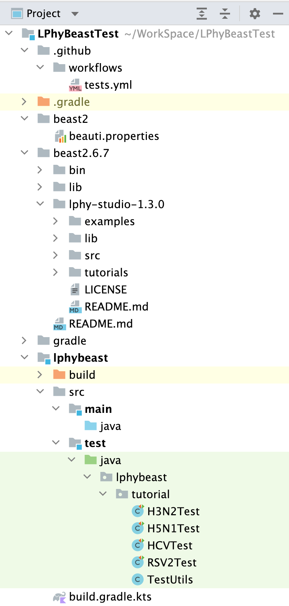

# LPhyBeastTest

Comprehensive integration tests for LPhyBeast + BEAST2 tutorials

## Due to Github issue

This project will run in NeSI.

## Project structure

1. __beast__

This directory contains the installed BEAST2 applications, where the scripts 
in the subfolder `bin` are modified to use the `beast` directory as the package directory.
It also contains the configuration file `beauti.properties` to add the prerelease.xml.
Also see https://www.beast2.org/managing-packages/

2. __lphy-studio-1.?__

This directory is under __beast?__, containing the installed LPhy and LPhy studio.

3. __lphybeast__

This directory contains JUnit tests, and also the BEAST 2 XMLs, log files and tree logs at runtime. 

## Run tests

- Update all dependencies, such as lphy, beast2, etc.

- Test LPhyBeast or LPhyBeastExt before final release
  1. update the versions and links in [prerelease.xml](beast2.7/lib/prerelease.xml).
  2. set the env variable `PRERELEASE` to `true` in [tests.yml](.github/workflows/tests.txt).
  3. commit and push to trigger the testing workflow.

- Test LPhyBeast or LPhyBeastExt after final release
  1. update the versions and links in [CBAN](https://github.com/CompEvol/CBAN).
  2. set the env variable `PRERELEASE` to `false` in [tests.yml](.github/workflows/tests.txt).
  3. commit and push to trigger the testing workflow.
