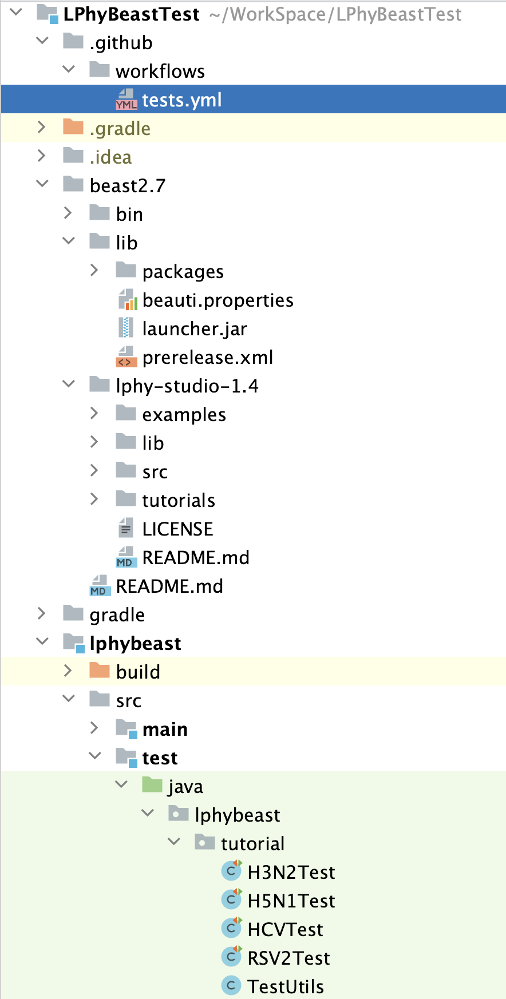

# LPhyBeastTest

Comprehensive integration tests for LPhyBeast + BEAST2 tutorials

## Project structure

1. **beast2**

This directory contains all BEAST2 packages installed at runtime, 
and also the configuration file `beauti.properties` to add the "extra" BEAST2 packages.

2. __beast2.?.?__

This directory contains the installed BEAST2 applications, where the scripts 
in the subfolder `bin` are modified to use the `beast2` directory as the package directory.
Also see https://www.beast2.org/managing-packages/

3. __lphy-studio-1.?.?__

This directory is under __beast2.?.?__, containing the installed LPhy and LPhy studio.

4. __lphybeast__

This directory contains JUnit tests, and also the BEAST 2 XMLs, log files and tree logs at runtime. 

## Run tests

- Update all dependencies, such as lphy, beast2, etc.

- Test LPhyBeast or LPhyBeastExt before final release
  1. update the versions and links in [prerelease.xml](beast2/prerelease.xml).
  2. set the env variable `PRERELEASE` to `true` in [tests.yml](.github/workflows/tests.yml).
  3. commit and push to trigger the testing workflow.

- Test LPhyBeast or LPhyBeastExt after final release
  1. update the versions and links in [CBAN](https://github.com/CompEvol/CBAN).
  2. set the env variable `PRERELEASE` to `false` in [tests.yml](.github/workflows/tests.yml).
  3. commit and push to trigger the testing workflow.
